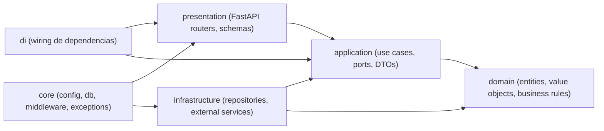
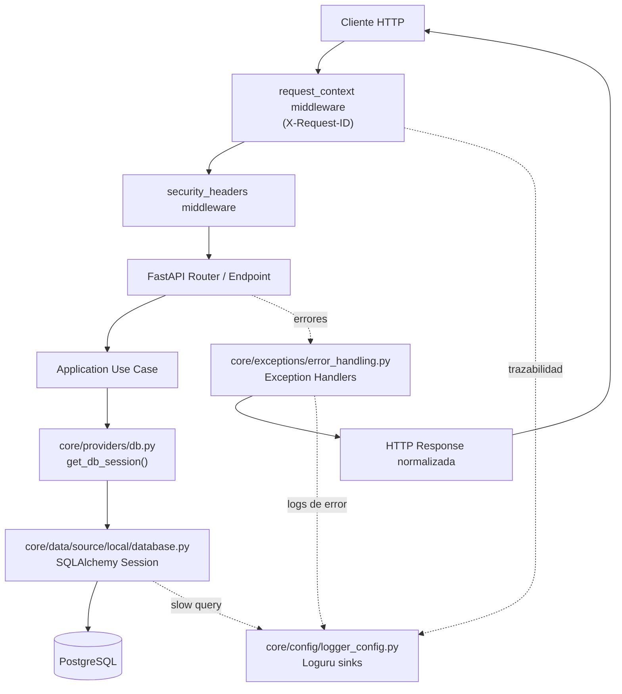

# ARCHITECTURE.md

## 1) Visión general (alto nivel)

Este proyecto es un **monolito modular** en FastAPI, organizado por **feature** y por **capas** siguiendo **Clean Architecture + DDD**.

Objetivo principal:
- Mantener reglas de negocio aisladas de frameworks.
- Permitir crecimiento por feature sin acoplamiento excesivo.
- Facilitar testeo por capa (unit, integration, e2e).

## 2) Estructura del repositorio

```text
app/
├── main.py
├── core/
│   ├── config/
│   ├── data/source/local/
│   ├── exceptions/
│   ├── middleware/
│   ├── providers/
│   └── router/
└── features/
    ├── auth/
    ├── todos/
    └── users/

tests/
├── core/
├── features/
└── e2e/
```

Cada feature contiene la misma forma base:
- `domain`
- `application`
- `infrastructure`
- `presentation`
- `di`

## 3) Diagrama de capas



Regla de dependencia:
- `presentation -> application -> domain`
- `infrastructure -> application + domain`
- `domain` no depende de frameworks.

## 4) Features actuales

- `auth`
- `users`
- `todos`

> La feature `notifications` fue **eliminada** durante la remediación de production-readiness (PR #80): dead code / YAGNI (puertos gordos cruzando features, use case sin endpoint, N+1 en `process_reminders`). El registro de su diseño original queda en `docs/history/` (`PRD_FASE9_EMAIL_NOTIFICATIONS.md`, `SDD_PROPOSAL_PHASE7_NOTIFICATIONS.md`).

> Este documento parte en alto nivel. En las siguientes iteraciones iremos profundizando **feature por feature** (casos de uso, entidades, contratos, decisiones específicas y edge cases).

## 5) Decisiones de diseño (primera versión)

1. **Monolito modular por feature** en vez de microservicios.
   - Tradeoff: menor complejidad operativa ahora, menor independencia de deploy por módulo.

2. **Clean Architecture + DDD táctico**.
   - Tradeoff: más estructura inicial, pero mejor mantenibilidad y testabilidad.

3. **SQLAlchemy + Alembic** para persistencia y migraciones.
   - Tradeoff: curva de aprendizaje ORM/migraciones, pero control explícito del esquema.

4. **Wiring explícito por feature (`di`)**.
   - Tradeoff: algo de boilerplate, pero dependencias más claras.

## 6) Configuración y bootstrap

Puntos clave observados en implementación:
- App bootstrap en `app/main.py`.
- Registro de middlewares de seguridad y request-id.
- Registro de exception handlers globales.
- Inclusión de routers por feature.
- OpenAPI custom con política de seguridad por defecto (BearerAuth) y excepciones para rutas públicas.

### 6.1 Núcleo transversal (`app/core`)

El directorio `app/core` concentra capacidades compartidas por todas las features:

1. **`config/`**
   - `env_config.py`: carga de configuración con Pydantic Settings.
   - `logger_config.py`: logging multi-sink (consola, archivos rotativos, errores, JSONL).

2. **`data/source/local/`**
   - `database.py`: creación de engine/sesiones SQLAlchemy y logging de slow queries.
   - `sql_alchemy_base.py`: base ORM compartida.
   - `alembic/`: configuración y versiones de migraciones.

3. **`providers/`**
   - `env_config.py`: provider cacheado (`lru_cache`) de `EnvConfig`.
   - `db.py`: provider de sesión de DB para DI.

4. **`exceptions/`**
   - `exceptions.py`: excepciones de dominio/aplicación.
   - `error_handling.py`: mapeo global a respuestas HTTP consistentes.

5. **`middleware/`**
   - `request_context.py`: inyección y propagación de `X-Request-ID`.
   - `security_headers.py`: headers de seguridad por respuesta.
   - `rate_limit_global.py`: middleware base para rate limiting global.

6. **`router/`**
   - `router.py`: factory para routers versionados.

Tradeoffs del `core`:
- Pro: estandariza cross-cutting concerns (logs, errores, seguridad, DB).
- Contra: exige disciplina para no convertir `core` en "cajón de sastre".

### 6.1.1 Diagrama de flujo del core



### 6.2 Contratos comunes (`app/common`)

Archivos principales:
- `app/common/use_case.py`
- `app/common/use_case_no_params.py`
- `app/common/domain_error.py`

Decisión actual:
1. **Contrato base de casos de uso** con `UseCase[Input, Output]` y `UseCaseNoParams[Output]`.
2. **`DomainError`** (base de invariantes de dominio, hereda de `ValueError`): el handler global la mapea a `400`, mientras que un `ValueError` pelado inesperado cae a `500` — separa "error del cliente" de "bug interno" (T4).

Objetivo:
- Estandarizar la capa de aplicación y mantener consistencia entre features.

## 7) Hardening y remediación de production-readiness

El proyecto pasó por una auditoría formal de 4 bloques (arquitectura, seguridad, testing, operación) y una remediación completa por fases (PRs #66–#94). El detalle se documenta en:
- `docs/REMEDIATION_PROGRESS.md` — estado y PRs por fase (fuente viva).
- `docs/history/AUDIT_PRODUCTION_READINESS.md` — la auditoría original (snapshot "antes").

Hardening aplicado (resumen):
- **Seguridad**: rate limiting global por IP registrado, derivando la IP real en `app/core/http_utils.py` desde el valor **más a la derecha** de `X-Forwarded-For`; CSRF de OAuth vía cookie httpOnly firmada + `secrets.compare_digest`; OTP con HMAC-SHA256; HSTS/CSP; sanitización de logs; `InvalidHash` → fallo de auth limpio.
- **Operación**: migración en startup **resiliente** (reintentos con backoff ante DB inalcanzable, fail-fast ante errores de esquema, arranque degradado si la DB no vuelve); `/health` → 503 si la DB no responde; body-size limit middleware; connection pool (`pool_pre_ping`, `pool_recycle`); `DELETE` → 204; paginación en listados.
- **Arquitectura**: puerto `UserProvider` (desacople auth↔users); excepciones de dominio (`DomainError`); eliminación de la feature `notifications`.
- **Testing**: red de tests sobre **PostgreSQL real** (testcontainers) con migraciones Alembic; gate `--cov-branch --cov-fail-under=85`; gate de no-drift (`alembic check`).

## 8) Features (orden lógico por dependencia)

### 8.1 Auth

Rol arquitectónico:
- Provee autenticación/autorización base (login, refresh, me, OTP/password change).
- Es fundacional para proteger rutas de `users` y `todos`.

Estructura interna de `app/features/auth`:

1. **`application/`**
   - `constants.py`: constantes de negocio de auth (propósitos/flags y valores compartidos).
   - `contracts/auth_datasource.py`: puerto para operaciones de usuario/auth persistidas.
   - `contracts/token_manager.py`: contrato para emisión/validación de tokens.
   - `contracts/token_revocation_store.py`: contrato para revocación/rotación de refresh token.
   - `contracts/otp_datasource.py`: contrato para ciclo de vida OTP.
   - `contracts/password_manager.py`: contrato para hash/verify de contraseñas.
   - `contracts/rate_limiter.py`: contrato para protección anti abuso en endpoints sensibles.
   - `contracts/email_sender.py`: puerto para envío de OTP/notificaciones auth.
   - `contracts/oauth_provider.py`: contrato de proveedor OAuth externo.
   - `contracts/google_auth_datasource.py`: contrato para persistencia de vínculo Google↔usuario.
   - `dto/*.py`: parámetros y resultados tipados de casos de uso (`login`, `register`, `refresh`, `otp`, `google`).
   - `usecases/login_user_use_case.py`: autentica credenciales y emite token pair.
   - `usecases/register_user_use_case.py`: registra usuario con reglas de unicidad/seguridad.
   - `usecases/refresh_access_token_use_case.py`: refresh token rotation + nueva access token.
   - `usecases/get_current_user_use_case.py`: resuelve usuario autenticado actual.
   - `usecases/request_otp_use_case.py`: genera OTP para flujo seguro de cambio de password.
   - `usecases/change_password_with_otp_use_case.py`: valida OTP y rota contraseña.
   - `usecases/verify_otp_use_case.py`: validación OTP (flujo legacy/deprecado).
   - `usecases/initiate_google_login.py`: inicia flujo OAuth de Google.
   - `usecases/handle_google_callback.py`: procesa callback OAuth y estado de autenticación.
   - `usecases/link_google_account.py`: vincula cuenta local con identidad Google. La validación de contraseña y la regla de negocio (no duplicar google_id, verificar contraseña antes de vincular) residen en el caso de uso, no en el endpoint (fix #59).

2. **`domain/`**
   - `entities/otp_code.py`: entidad de dominio OTP (vigencia, propósito, consumo).
   - `value_objects/otp_purpose.py`: enum `OtpPurpose(StrEnum)` con propósitos válidos (`PASSWORD_CHANGE`) — centraliza validación en dominio y evita valores inválidos (fix #60).
   - `value_objects/refresh_token_id.py`: VO para identidad/normalización de refresh token.

3. **`infrastructure/`**
   - `managers/jwt_token_manager.py`: implementación JWT del `token_manager`.
   - `managers/password_manager_impl.py`: implementación de hash/verify de contraseñas.
   - `models/otp_model.py`: modelo ORM de OTP.
   - `models/refresh_token_model.py`: modelo ORM de refresh token/revocación.
   - `repositories/auth_repository.py`: implementación SQLAlchemy de auth datasource.
   - `repositories/otp_repository.py`: persistencia OTP.
   - `repositories/token_revocation_repository.py`: persistencia de revocación/rotación de refresh.
   - `repositories/google_auth_repository.py`: persistencia para vínculo/auth con Google.
   - `providers/smtp_email_sender.py`: sender SMTP real para OTP.
   - `providers/resend_email_sender.py`: sender vía Resend.
   - `providers/console_email_sender.py`: sender de desarrollo local.
   - `providers/google_oauth_provider.py`: integración real OAuth Google.
   - `providers/stub_google_oauth_provider.py`: provider stub para entornos de test/dev.
   - `security/in_memory_rate_limiter.py`: rate limiter en memoria para control de abuso.

4. **`presentation/`**
   - `api.py`: endpoints `/auth/v1/*` y wiring HTTP del módulo. Incluye:
     - `GET /auth/v1/google` → `200` con `{ authorization_url }` en body (JSON, no redirect — fix #58).
     - `GET /auth/v1/google/callback` → `200` con token pair.
     - `POST /auth/v1/link-google` → vincula Google a usuario autenticado (regla de negocio en use case, no en endpoint — fix #59).
   - `security_dependencies.py`: dependencias de seguridad (Bearer/current user).
   - `schemas/auth_requests.py`: schemas de entrada auth.
   - `schemas/auth_responses.py`: schemas de salida auth.
   - `schemas/google_auth_requests.py`: schemas específicos de OAuth Google (`GoogleInitResponse`, `GoogleLinkAccountRequest`, `GoogleLinkAccountResponse`).
   - `mappers/auth_mapper.py`: transformación schema ↔ DTO.

5. **`di/`**
   - `dependencies.py`: ensamblaje de casos de uso e implementaciones concretas por contrato.

Decisiones de diseño de Auth:
1. Separar puertos (`application/contracts`) de implementaciones (`infrastructure/*`).
2. Manejar refresh token con rotación/revocación explícita.
3. Mantener OTP como entidad de dominio con propósito y expiración.
4. Aislar OAuth Google tras contratos para permitir stubs/reemplazo de provider.
5. `OtpPurpose` como `StrEnum` en dominio (no string suelto) — validación en el origen, no en infraestructura (fix #60).
6. `GET /auth/v1/google` retorna `200` con URL en body (no `302 redirect`) — el frontend decide cómo navegar, no el backend (fix #58).
7. Regla de negocio de `link-google` en el caso de uso, no en el endpoint — mantener la separación Clean Architecture incluso en endpoints "simples" (fix #59).
8. Parseo estructurado de nombres Google (`given_name` + `family_name` vs un solo `name`) — el provider mapea campos separados, no un string plano (fix #57).
9. **Rate limiting global por IP registrado**, con la IP del cliente derivada en `app/core/http_utils.py:get_client_ip` desde el valor **más a la derecha** de `X-Forwarded-For` — el que agrega el edge de confianza. Sin esto el throttle agrupaba a todos bajo la IP del proxy de Render (S1/O12, PR #74). Se **descartó** `uvicorn --proxy-headers --forwarded-allow-ips='*'` (el fix que proponía la auditoría) porque confía en el valor más a la izquierda, controlado por el cliente: bastaba rotar la cabecera para evadir el límite. El default es fail-closed (sobre-limita) en vez de fail-open.
10. **CSRF de OAuth**: el `state` se ata al navegador vía cookie httpOnly firmada al iniciar y se compara con `secrets.compare_digest` en el callback (S2, PR #78).
11. **OTP con HMAC-SHA256** (secreto de servidor) en vez de SHA-256 pelado — anula rainbow tables si se filtra la BD (S5, PR #78).
12. **`verify_password` captura `InvalidHash`** → fallo de auth limpio en vez de 500 ante un hash malformado en BD (S8, PR #74).

### 8.2 Users

Rol arquitectónico:
- Gestión de identidad y perfil de usuario.
- Dependencia funcional de Auth para contexto del usuario autenticado.

Estructura interna de `app/features/users`:

1. **`application/`**
   - `contracts/user_datasource.py`: puerto de persistencia para operaciones de usuario.
   - `contracts/user_provider.py`: puerto que `users` expone a otras features (p.ej. `auth`) para resolver/crear usuarios sin acoplarse al modelo ORM. Desacople de features (A1, PR #84).
   - `dto/get_user_by_id_params.py`: parámetros tipados para consulta por id.
   - `dto/update_user_params.py`: parámetros tipados para actualización de perfil.
   - `dto/delete_user_params.py`: parámetros tipados para eliminación de usuario.
   - `usecases/get_user_by_id_use_case.py`: consulta de usuario por id.
   - `usecases/update_user_use_case.py`: actualización de datos de usuario.
   - `usecases/delete_user_use_case.py`: eliminación de usuario.

2. **`domain/`**
   - `entities/user.py`: entidad principal de usuario con `password_hash: str | None` (nullable para usuarios OAuth), `google_id: str | None`, `google_email_verified: bool`, método `change_password_hash(new_hash)` para setear contraseña después, y `_validate_password_hash()` que omite validación cuando `password_hash` es `None`.
   - `value_objects/email.py`: value object con validaciones de email.

3. **`infrastructure/`**
   - `models/user_model.py`: modelo ORM de usuario con `password_hash` nullable y columna `google_id`.
   - `mappers/user_mapper.py`: mapeo ORM ↔ entidad de dominio.
   - `repositories/user_repository.py`: implementación SQLAlchemy del `user_datasource`.
   - `repositories/user_provider_repository.py`: implementación del `user_provider` que consume `auth`.

4. **`presentation/`**
   - `api.py`: endpoints `/v1/users` (detalle propio, actualizar, eliminar → `204`). El listado `GET /v1/users` fue **eliminado** (exponía PII de todos los usuarios a cualquier autenticado — O4, PR #90).
   - `schemas/user_requests.py`: schemas de entrada para update.
   - `schemas/user_responses.py`: schemas de salida HTTP.
   - `mappers/user_mapper.py`: transformación schema ↔ DTO.

5. **`di/`**
   - `dependencies.py`: wiring de repositorio y casos de uso.

Decisiones de diseño de Users:
1. Encapsular validación de email en Value Object de dominio.
2. Mantener CRUD de usuarios detrás de casos de uso (sin acceso directo desde presentation a repositorio).
3. Separar mapper de infraestructura (persistencia) del mapper de presentación (HTTP).
4. **Exponer un puerto `UserProvider`** para que `auth` resuelva usuarios sin importar el `UserModel` de `users` — restaura la autonomía entre features (A1, PR #84).
5. **No exponer listados de PII**: `GET /v1/users` se eliminó; sin RBAC, un listado de todos los usuarios es una fuga (O4, PR #90).

### 8.3 Todos

Rol arquitectónico:
- Núcleo funcional de tareas del usuario autenticado.
- Depende de Auth/Users para ownership y control de acceso.

Estructura interna de `app/features/todos`:

1. **`application/`**
   - `contracts/todo_datasource.py`: puerto de persistencia para operaciones de TODO.
   - `dto/create_todo_params.py`: parámetros tipados para creación.
   - `dto/get_todos_params.py`: parámetros para listado (scope por usuario).
   - `dto/get_todo_by_id_params.py`: parámetros para detalle por id.
   - `dto/update_todo_params.py`: parámetros para actualización.
   - `dto/delete_todo_params.py`: parámetros para eliminación.
   - `usecases/create_todo_use_case.py`: crea TODO del usuario autenticado.
   - `usecases/get_todos_use_case.py`: lista TODOs por contexto de usuario.
   - `usecases/get_todo_by_id_use_case.py`: obtiene TODO puntual con control de ownership.
   - `usecases/update_todo_use_case.py`: actualiza campos permitidos de TODO.
   - `usecases/delete_todo_use_case.py`: elimina TODO del usuario.

2. **`domain/`**
   - `entities/todo.py`: entidad principal TODO (estado, reglas de negocio y fechas).

3. **`infrastructure/`**
   - `models/todo_model.py`: modelo ORM de TODO.
   - `mappers/todo_mapper.py`: mapeo ORM ↔ entidad de dominio.
   - `repositories/todo_repository.py`: implementación SQLAlchemy del `todo_datasource`.

4. **`presentation/`**
   - `api.py`: endpoints `/v1/todos` (create → `201`, list **paginado** con `limit`/`offset`, get, update, delete → `204`).
   - `schemas/todo_requests.py`: schemas de entrada para create/update.
   - `schemas/todo_responses.py`: schemas de salida HTTP.
   - `mappers/todo_mapper.py`: transformación schema ↔ DTO.

5. **`di/`**
   - `dependencies.py`: wiring de repositorio y casos de uso de TODOs.

Decisiones de diseño de Todos:
1. Encapsular reglas de TODO en entidad de dominio y casos de uso.
2. Forzar ownership en capa de aplicación para evitar acceso cruzado entre usuarios.
3. Separar mapeo de persistencia y mapeo HTTP para mantener bordes claros.
4. **Paginar el listado** (`limit`/`offset`, con `total` en la respuesta) — evita devolver toda la tabla (O4, PR #90).
5. **Validar el invariante de fecha solo en creación**, no en rehidratación — leer un TODO ya vencido no debe lanzar (A2, PR #72).

> **Nota:** existía una feature `notifications` (recordatorios de TODOs vencidos), eliminada en la remediación (PR #80). Su diseño original se conserva en `docs/history/`.

## 9) Matriz de cobertura por feature (happy path + edge cases + riesgos)

> Baseada en estructura de tests actual en `tests/features/*` + revisión arquitectónica.

| Feature | Happy path | Edge cases | Cobertura por capas | Riesgo actual |
|---|---|---|---|---|
| Auth | Alto | Medio-Alto | application, domain, infrastructure, presentation | Medio |
| Users | Alto | Medio | application, domain, infrastructure, presentation | Medio |
| Todos | Alto | Medio | application, domain, infrastructure, presentation | Medio |

> Todos los tests corren contra **PostgreSQL real** (testcontainers) con las migraciones Alembic aplicadas; gate `--cov-branch --cov-fail-under=85` + gate de no-drift (`alembic check`).

### 9.1 Evidencia rápida de tests por feature

- **Auth** es la feature más profunda, especialmente en casos de seguridad (rotación/reuso de refresh, OTP, OAuth/CSRF).
- **Users** y **Todos** tienen cobertura balanceada por capa, con menor volumen total que Auth.

### 9.2 Lectura crítica (auditoría)

1. **Auth** está más robusto y profundo que el resto, especialmente en casos de seguridad.
2. **Users/Todos** tienen cobertura balanceada por capa, pero con menor volumen total que Auth.
3. Hay oportunidad transversal de reforzar **core tests** (`main`, health/openapi/middlewares), fuera de features.

## 10) Plan de expansión de este documento

Próximas secciones (iterativas):
1. Profundizar flujos críticos por feature con diagramas secuenciales.
2. Cerrar checklist de hardening con estado (`TODO -> DONE`) por item.
3. Agregar mapa de dependencias entre features (`Auth -> Users -> Todos`).
4. Incorporar decisiones ADR-lite (1 sección por decisión clave).

---

## Estado de este archivo

**Versión extendida con core + features + matriz de cobertura**. Lista para iterar hardening y auditoría fina.
